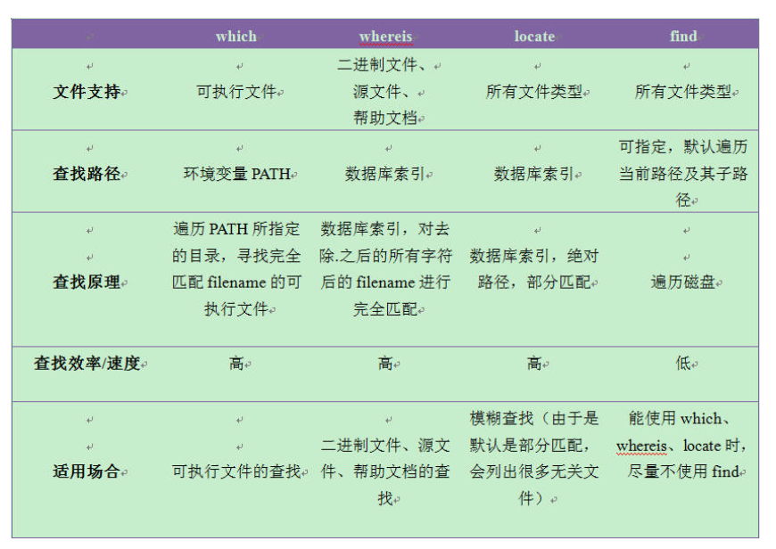

# Linux Learning
由于之前比较少使用Linux，在使用服务器的过程中会遇到一些坑，所以在此记录下来
## 2018-11-1
linux下的换行为/n,windows下的换行为/r/n,而且貌似用secureCRT/Xshell远程使用键入的换行也默认为windows下的/r/n
## 2018-11-3
```
ls指令的常用参数
-a : 显示所有文件
-l : 显示文件的详细信息
e.g. ls -la *.txt

cp:
e.g.
cp * /tmp 把当前目录下的所有未隐藏文件复制到/tmp/目录下
cp -a SourceDirectory Direction  #-a 针对的是目录
-i #覆盖前询问用户
-v #告诉用户正在做什么

mv

rm 命令不删除目录，除非指定了-r参数
rm -rf domed 删除domed目录下及它所包含的所有内容

mkdir -p d1/d2/d3 建立嵌套目录

more/less
more功能类似cat，cat命令是整个文件的内容从上到下显示在屏幕上，more会以一页一页的显示方便使用者逐页阅读
常用操作命令：
Enter 向下n行，需要定义，默认为1行
Ctrl+F 向下滚动一屏
space  向下滚动一屏
Ctrl+B 返回上一屏
=      输出当前的行号
:f     当前文件名和行号
V      调用vi编辑器
!命令  调用shell，并执行命令
q      退出


grep(global search regular expression(RE) and print out the line)
包括grep,egrep,fgrep。egrep和fgrep的命令只根grep有很小不同。
# grep [-n][-v][-A3][-B2] class KNN.java 将KNN.java出现class的行取出来
-n 显示行号
--color=auto 将关键字部分用颜色显示
-v 将没有出现class的行取出来
-A3 前三行
-B3 后三行

# grep 'class' *
# grep -r 'class' * #递归搜索含'class'的
# grep -l -r 'class' * #只显示文件，不显示行
在~/.bashrc加上 alias grep = 'grep --color=auto'，然后 source ~/.bashrc 生效  
dmesg 核心信息
```
.开头的文件为隐藏文件
/ - 根目录，每个文件和目录都从这里开始，只有root用户具有该目录下的写权限。此目录和/root目录不同，/root目录是root用户的主目录。home是用户的家目录，里面放置了用户的环境变量
|管道符 
ls|more 

### vim编辑器的使用
```
# vi a b c 
依次打开a,b,c文件
:n   -下一个文件
:e filename   -回到filename文件
:e#  - 返回上一个文件
```


## 2019-2-27
* shell
0:标准输入
1:标准输出
2:标准错误输出
> 标准输出重定向, 与1>等同
e.g.
2>&1 标准错误输出重定向到标准输出
&>file 标准输出和标准错误输出都定向到fil中
rm -f $(find / -name core) &> /dev/null, /dev/null是一个文件，所有传给它的东西它都丢弃掉。

## 2019-12-3
Linux 查找指令


进程相关指令
* jobs (-l) 显示挂起，正在运行的程序。
* kill %(jobs number)

常用指令：
* ln/ln -s (软连接/硬连接)
* > 覆盖原文件 / >> 在文件末尾添加
* chown 用户名:组名 文件路径(4=read, 2=write, 1=execute)
* chmod 文件拥有者
* du: disk usage / du -h 每个文件的大小 /du -hs 该目录的总大小
* df -h 显示磁盘的可用空间。

shell使用技巧：
* 使用ctrl+r搜索命令行历史记录。

解压：
```shell 
tar -xzvf 解压(-xvf 解压.tar, -xzvf 解压tar.gz) x:解压, v:日志, f:文件路径 z:gz 
tar -czvf 压缩
```


## 2019-12-4
查看Ubuntu版本
```shell
cat /proc/version
```

端口映射
* -L 将本地的某个端口映射到远程主机的某个端口
* -R 将远程主机的某个端口映射到本机的某个端口
* -N 不执行远程命令，用于转发端口
```shell
ssh -f N -L 8889:localhost:8888

ssh-copy-id -i ~/.ssh/id_rsa.pub host@ip address
```

