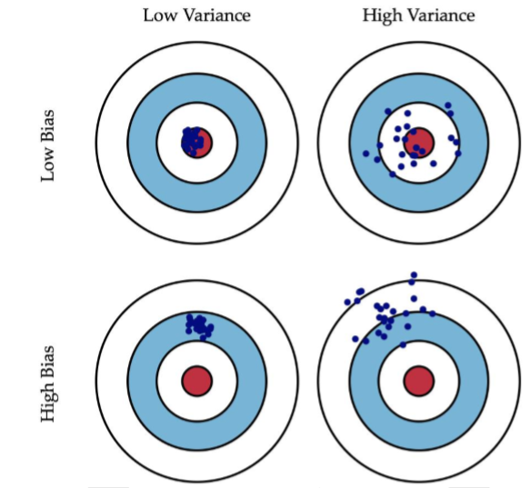

# Machine Learning concepts
This doc marks down the Deep Learning(Machine Learning) concepts that I never heard of. 

## end-to-end learning
非端到端：传统的机器学习的流程往往由多个模块组成，比如一个典型的NLP，包括分词，词性标注等多个独立步骤，每个步骤是一个独立的任务，其结果的好坏会影响到下一步骤，从而影响整个训练的结果

端到端：深度学习都是端对端学习

## receptive field
感受野：

## hinge function/loss

## train from scratch
从头开始训练

## [b, h , w , c]
b: batchsize
h: height
w: with
c: channels

## upsampling and downsampling

## Loss function & cost function
cost function 是 loss function在所有样本点上的总和。
经验风险损失函数和结构风险损失函数：经验风险损失函数指预测结果和实际结果的差别，结构风险损失函数是在经验风险损失函数加上正则项。

## Cross-Entropy
KL散度（相对熵）：In the context of machine learning,D_{kl}(P||Q) is offen called the information gain achieved if P is used instead of Q
(https://blog.csdn.net/tsyccnh/article/details/79163834)

## ROC & AUC
ROC (FPR)x-axis (TPR)y-axis
Advantage: ROC不随阈值改变而改变。 

## 偏差和方差
generalization error = bias + variance + noise
偏差大说明模型欠拟合，方差大说明模型过拟合。

## cost curve
代价曲线：
在均等代价时，ROC曲线不能直接反应出模型的期望总体代价，而代价曲线可以。
代价曲线横轴为[0,1]的正例函数代价：

$$P(+)Cost=\frac{p\*Cost_{01}}{p\*Cost_{01}+(1-p)\*Cost_{10}}$$

其中p是样本为正例的概率。

代价曲线纵轴维[0,1]的归一化代价：
$$Cost_{norm}=\frac{FNR*p*Cost_{01}+FNR*(1-p)*Cost_{10}}{p*Cost_{01}+(1-p)*Cost_{10}}$$

## （参数估计）点估计，区间估计，中心极限定理之间的联系
点估计：用样本统计量来估计总体参数，因为样本统计量为数组上某一点指，估计的结果也以一个点的数值表示，所以称为点估计。
区间估计：通过从总体中抽取的样本，根据一定的正确度与精确度的要求，构造出适当的区间，以作为总体的分布参数（或参数的函数）的真值所在范围的估计。
1. 中心极限定理是推断统计的理论基础，推断统计包括参数估计和假设检验，其中参数估计包括点估计和区间估计，所以说，中心极限定理也是点估计和区间估计的理论基础。
2. 参数估计有两种方法：点估计和区间估计，区间估计包括了点估计。
相同点：都是基于一个样本作出；
不同点：点估计只提供单一的估计值，而区间估计基于点估计还提供误差界限，给出了置信区间，受置信度的影响。

## 类别不平衡问题解决方法
1. 扩大数据集
2. 对大类数据欠采样
3. 对小类数据过采样
4. 使用新评价指标
5. 选择新算法
6. 数据代价加权（例如当分类任务是识别小类，可以对分类器的小类样本数据增加权值，降低大类样本的权值）

## Kernel function 
将原坐标系里线性不可分的数据用Kernel投影到另一个空间，尽量使得数据在新的空间里线性可分
