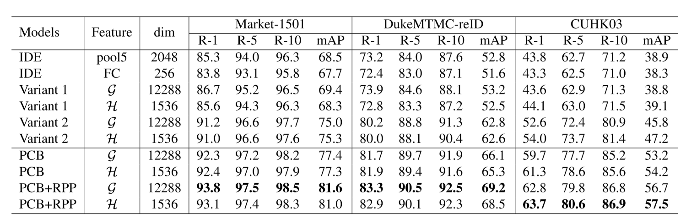
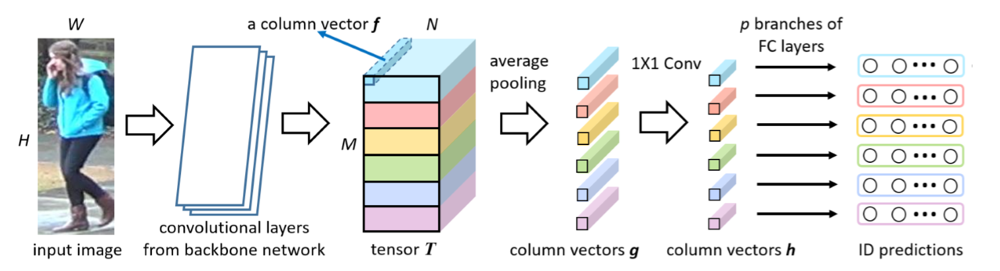
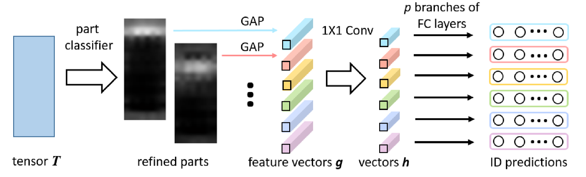
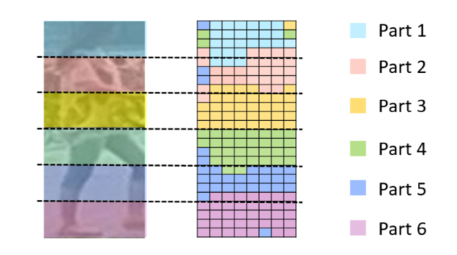
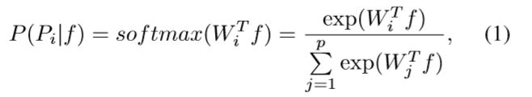
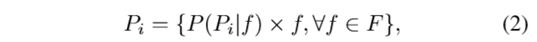

# PCB-RPP net
了解PCB-RPP网络结构并验证PCB-RPP相关性能是否与论文一致，然后记录一些遇到的issue。
下图是论文中列出的一些不同结构网络的性能。
<br>

<br>
[源码地址](https://github.com/syfafterzy/PCB_RPP_for_reID)
<br> 
[论文地址](https://arxiv.org/pdf/1711.09349.pdf)
## dataset路径问题
linux下换行为/n，windows下为/r/n，secureCRT远程控制server时键入的enter貌似为/r/n，所以最好不要将路径参数放在命令最后。
## PCB
### Structure

### Theory
首先将图片输入一个backbone（GoogleNet/ResNet）网络中，原作者在这使用的是ResNet50(移除GAP(global average pool)层和其后的FC层)。得到的tensor T后将其等分成6份（RPP的分发不同）输入一个average pooling层后分为6个一维向量，然后再利用1x1 Conv层降维(2048\*6 -> 256\*6)（Feature为$g$不需要该层）,最后分别输入到不同6个不同的FC层得到loss0~loss5，Optimizer用的是CrossEntropy，evaluate mode下使用的feature为($g_0 \ldots g_5$)或($h_0 \ldots h_5$).
### details
|Parameter| value|
|  -      |  -   |
| epochs  | 60   |
|LR       | 0.1 - 0.01(40 epochs)|
|batch-size| 64  |
|pretrained| True(by ImageNet)|
* $g$ or $h$
根据作者给出的数据，1x1conv降维后网络性能并没有大的改变，但是$h$的训练速度会大大增加。
* Variant 1 and Variant 2
作者提出了两种变种分别为Variant 1:对vector $g$($h$)做平均后再输入到一个FC层中，即将原来的6个分类器减少到1个.Variant 2:6个分类器共享参数。
### results
* PCB($h$)
```
Mean AP: 78.2%
CMC Scores    allshots      cuhk03  market1501
  top-1          60.2%       79.7%       92.3%
  top-5          74.0%       92.9%       97.0%
  top-10         79.5%       95.6%       98.3%
```
* PCB($g$)
```
Mean AP: 74.5%
CMC Scores    allshots      cuhk03  market1501
  top-1          54.8%       76.5%       90.1%
  top-5          69.9%       91.7%       96.6%
  top-10         75.9%       95.0%       97.4%
```
* Variant 1($h$)
```
Mean AP: 72.0%
CMC Scores    allshots      cuhk03  market1501
  top-1          50.2%       75.7%       87.5%
  top-5          67.1%       92.1%       95.8%
  top-10         74.3%       95.2%       97.6%
```
* Variant 1($g$)
```
Mean AP: 64.0%
CMC Scores    allshots      cuhk03  market1501
  top-1          41.1%       67.7%       81.3%
  top-5          58.4%       88.2%       91.9%
  top-10         66.3%       92.8%       95.1%
```
* Variant 2($h$)
```
```
* Variant 2($g$)
```
```
### code
由于原作者源码中并没有给出Variant 1,Variant 2的代码，所以简单对PCB修改。
* PCB -> Variant 1
```python

            x_avg = (x0 + x1 + x2 + x3 + x4 + x5)/6 
            c_avg = self.instance0(x_avg)
            #c0 = self.instance0(x0)
            #c1 = self.instance1(x1)
            #c2 = self.instance2(x2)
            #c3 = self.instance3(x3)
            #c4 = self.instance4(x4)
            #c5 = self.instance5(x5)
            #return out0, (c0, c1, c2, c3, c4, c5), local_mask
            return out0, c_avg, local_mask 


```

* PCB -> Variant 2 
```python
            #共享参数
            c0 = self.instance0(x0)
            c1 = self.instance0(x1)
            c2 = self.instance0(x2)
            c3 = self.instance0(x3)
            c4 = self.instance0(x4)
            c5 = self.instance0(x5)

```

* $h$ -> $g$
```python
            #将1x1conv去掉
            #x = self.drop(x)
            #x = self.local_conv(x)

            out1 = x.view(x.size(0),-1)
            out1 = x/x.norm(2,1).unsqueeze(1).expand_as(x)
            
            x# = self.feat_bn2d(x)
            out1 = x/x.norm(2,1).unsqueeze(1).expand_as(x)
            #x = F.relu(x) # relu for local_conv feature
```


## RPP
### structure

### Theory
PCB-RPP首先会在原PCB结构下训练到收敛(作者用了20 epochs)，此时将输出的vector $f$计算相似性，会得到下图的结果，RPP就是针对下图的outliners改进的。

具体改进就是用一个linear layer+softmax算出每个向量属于$P_i$的概率，然后按概率等比例分配至不同的stripe中。


### results
* PCB+RPP($h$)
```
Mean AP: 81.2%
CMC Scores    allshots      cuhk03  market1501
  top-1          63.8%       82.9%       93.0%
  top-5          77.3%       94.7%       97.2%
  top-10         82.7%       96.7%       98.0%
```
* PCB+RPP($g$)
```

```

## IDE
* IDE+pool5
```
```
* IDE+FC
```
```

### some issue
如果在我的server直接运行源码会出现几处由于pytorch和python版本问题的issue。
* issue 1:
```Python
torch.autograd.backward([ loss0, loss1, loss2, loss3, loss4, loss5],[torch.ones(1).cuda(), torch.ones(1).cuda(), torch.ones(1).cuda(),torch.ones(1).cuda(),torch.ones(1).cuda(),torch.ones(1).cuda(),torch.ones(1).cuda()]) 
#-----------------------------------------------------------------------------------------------------------
torch.autograd.backward([ loss0, loss1, loss2, loss3, loss4, loss5]) 
#--------------------------------------------------------------------
#查看官方文档：由于loss0~loss5是标量，所以是不需要variable_grad这个参数的，该参数在Loss为多维时相当于为每个维度设置不同的学习率。
```
* issue 2:
由于原文作业用的为Python 2， 所以有些/要换成//


