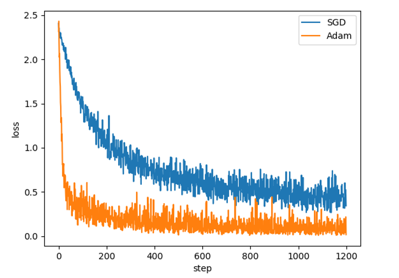

####  数据集
torchvision.dataset:包含常用的数据集。
DataLoader: 将数据集分成batch_size各batch从而进行批训练。

#### 网络结构
封装一个卷积层，一个卷积层由一个conv2d,bn2d,ReLU,maxpool组成
```
def conv_layer(in_channels,out_channels,kernel,stride=1,padding=2):
    layers = nn.Sequential(
        nn.Conv2d(in_channels,out_channels,kernel,stride,padding),
        nn.BatchNorm2d(out_channels),
        nn.ReLU(),
        nn.MaxPool2d(kernel_size=2)
    )
```

#### 搭建CNN网络：
1. 继承nn.Module
2. 在__init__()函数定义网络结构及参数
3. 在forward()函数连接各层网络
4. 每个卷积层的参数，如kernel，stride，padding都可以调整，每个层的输入输出根据stride,padding,kernel等值进行计算（第一层除外，MNIST为灰度图，初始in_channel固定为1）。
```
class CNN(nn.Module):
    def __init__():
        super.(CNN,self).__init__()
        self.conv1 = conv_layer(1,16,5,1,2)
        #只有一层卷积层的情况
        self.FC = nn.Linear(16*14*14,10)

        #两层卷积层的情况
        self.conv2 = conv_layer(16,32,5,1,2)
        self.FC = nn.Linear(32*7*7,10)

    def forward(self,x):
        x = self.conv1(x)
        #两层卷积层的情况
        x = self.conv2(x)

        x = x.view(x.size(0),-1)
        x = self.FC(x)
        return x
```
#### 训练网络
1. 选择optimizer
2. 选择loss function
```
cnn = CNN()
optimizer = optim.SGD(cnn.parameters(), lr = LR)
#optimizer = optim.Adam(cnn.parameters(), lr = LR)
#optimizer = optim.Adagrad(cnn.parameters(), lr = LR)
loss_function = CrossEntropyLoss()

for epoch in range(EPOCH):
    for step,(x,y) in enumerate(train_loader):
    # 主要5个步骤：1.将训练集x输入到CNN中得到pred_y
    # 2. 计算pred_y和真实y的误差函数
    # 3. 对optimizer的值清0  
    # 4. 误差反传
    # 5. 参数更新
        pred_y = cnn(x)
        loss = loss_function(pred_y,y)
        optimizer.zero_grad()
        loss.backward()
        optimizer.step()
```

#### 测试网络
将10000个测试样本输入网络中，计算准确率
```
test_out = cnn(test_x)
pred_y = torch.max(test_out, 1)[1].squeeze().numpy()
acc = float( (test_y.numpy() == pred_y ).astype(int).sum() ) / float(test_y.size(0))
```
#### 保存网络参数
```
    # 只保存参数，不保存结构
    torch.save(cnn.state_dict(), filename)  
```
####  可视化
简单做一些可视化



#### 参数调整/函数选择/网络结构
可以调整的参数有许多，比如每个卷积层中卷积核数，padding，stride等，但是个人估计对结果的影响不大。
网络结构：2层CONV+1层FC和1层CONV+1层FC的表现差不多。
函数选择：损失函数好像一般都使用交叉熵，至于优化器，实验发现SGD的收敛速度明显慢于其他优化器

损失函数中包含了LogSoftMax的计算